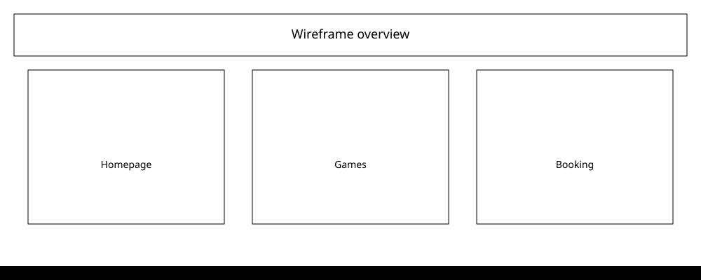
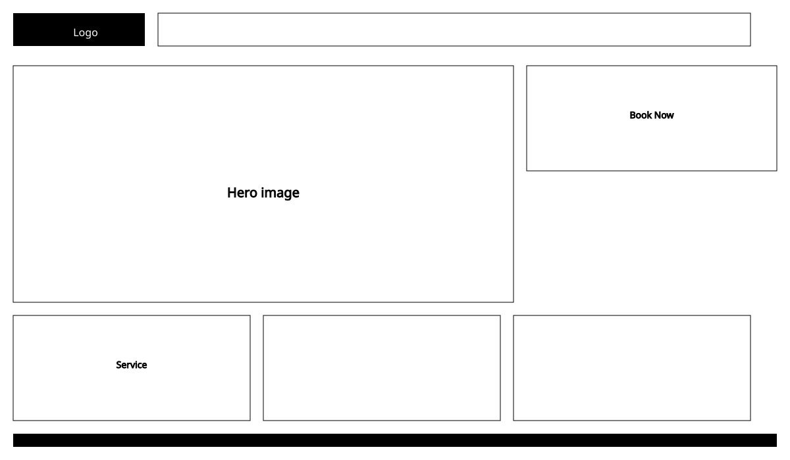
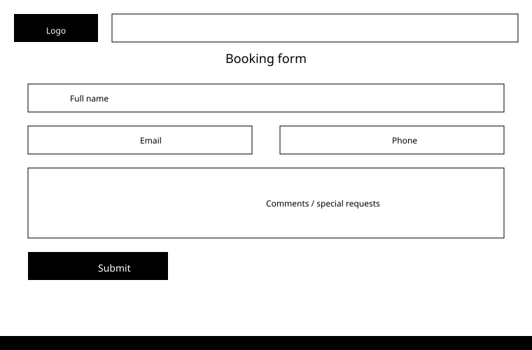

# 📘 Boardwalk Games – Wireframe Documentation

## Overview

These wireframes outline the structure and user flow for the Boardwalk Games website. They represent the key pages, navigation layout, booking flow, and footer information that will form the basis of the site build.

## Wireframe images

### Homepage wireframe

### Games library wireframe

### Booking form wireframe

## Global layout

Header / navigation

- Logo: Boardwalk Games

Navigation links

- Home
- Services
- Events
- Games
- Contact

Footer

- Contact information
- Opening times
- Newsletter sign-up form

## Homepage wireframe

Hero section

- Welcome message
- Short tagline describing the café and offerings
- Prominent "Book Now" button

## Services overview

Grid of service tiles:

- Play in our café
- Game library
- Events
- Kids parties
- 20% student discount
- Timetable of events

Each tile links to a relevant section or booking form.

## Services page wireframe

- Expanded descriptions of each service
- Secondary "Book Now" call-to-action
- Consistent layout with homepage tiles

## Events page wireframe

- Overview of weekly events, tournaments, and themed nights
- Button linking to booking form
- Space for future event listings or calendar

## Games library wireframe

- Intro text about the available board games
- Placeholder for future searchable/filterable game list

## Booking form wireframe

Form fields

- Full name
- Email
- Phone number
- Event type (dropdown)
- Comments (textarea)
- Submit button

Purpose

Allows users to submit booking enquiries for:

- General café bookings
- Kids parties
- Event nights
- Private hire

## Contact page wireframe

Contact information

- Email
- Phone number

Opening times

- Weekday and weekend hours

Newsletter sign-up

- Name field
- Email field
- Submit button

## Thank-you page wireframe

Displayed after form submission

- Confirmation message
- Link to return to homepage
- Contact info and newsletter sign-up repeated for convenience

## User flow summary

- User lands on Home
- Navigates via header or service tiles
- Chooses "Book Now" or a specific service
- Completes booking form
- Receives confirmation on the Thank-you page
